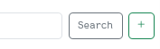
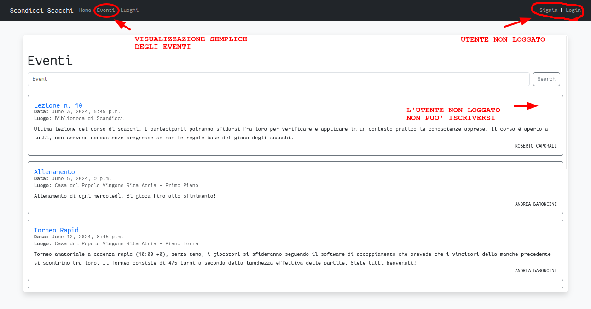
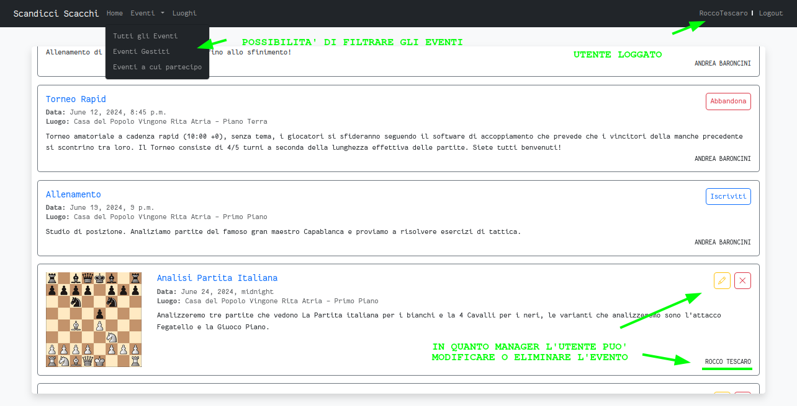

# PPM_ScandicciScacchi
Sviluppo backend di una pagina per la gestione di eventi.
L'applicazione corrente permette di gestire eventi di scacchi con la possibilità di iscriversi ad essi, visualizzare i partecipanti e i luoghi in cui si svolgeranno.
L'applicazione è stata sviluppata con __Django__ e __Python__.

La pagina principale mostra semplicemente un messaggio di benvenuto per l'utente e una barra di ricerca di eventi. Tramite barra di ricerca o barra di navigazione è possibile spostarsi nella pagina che elenca gli eventi. \
Sempre nella barra di navigazione è possibile effettuare il login o la registrazione (se loggati saranno invece riportati nome utente e pulsante di logout).
Quando si è loggati è possibile iscriversi ad un evento, abbandonarlo o in caso manager dell'evento, modificarlo o eliminarlo. \
In caso l'utente sia parte dello staff può anche creare un evento con il bottone apposito (vicino alla barra di ricerca, non visibile per i non staff). \

 
 Se loggati il link degli eventi presente nella barra di navigazione permette un filtraggio degli eventi per: tutti gli eventi, eventi gestiti dall'utente, eventi a cui l'utente è iscritto (la barra di ricerca filtra su tutti gli eventi sempre e comunque, quindi volendo è possibile ricaricare tutti gli eventi cercando una stringa vuota). Tramite il link del nome dell'evento è possibile accedere alla pagina che mostra i dettagli relativi all'evento stesso.

|  |  |
|:--:|:--:|
| Pagina degli eventi per utenti non loggati | Pagina degli eventi per utenti loggati |

__Credenziali di accesso__:

|__funzioni__|__username__|__password__|
|:--:|:--:|:--:|
| manager _(utente che gestisce eventi ma non può crearne)_ |_RobertoCaporali_|_ppmbe2024_|
| membro staff |_RoccoTescaro_|_ppmbe2024_|

Come si può notare, non solo i membri dello staff possono gestire eventi, infatti creando un nuovo evento posso decidere di delegare la gestione ad un altro utente (che diventerà manager dell'evento). Questo è possibile farlo tramite il campo "manager" presente nella creazione di un evento (a cui si accede con il bottone apposito indicato precedentemente accanto alla barra di ricerca). 

> __!__ Solo il manager dell'evento può però modificare o eliminare l'evento, pertanto un membro dello staff che decide di delegare la gestione dell'evento ad un altro utente non potrà più modificarlo o eliminarlo se non accedendo direttamente al database.

Nella pagina di creazione di un evento è possibile inserire i seguenti campi: nome, data, descrizione, luogo, manager e un campo per l'immagine dell'evento. 

Nella pagina che mostra i dettagli dell'evento oltre ai campi inseriti nella creazione dell'evento è possibile vedere i partecipanti all'evento. Sia il campo manager che i nomi dei partecipanti solo link che portano alla pagina del profilo dell'utente corrispondente. Dalla quale è possibile vedere gli eventi a cui è iscritto l'utente e gli eventi gestiti dall'utente. Anche il luogo dell'evento è un link che porta alla pagina del luogo in cui sono riportati similarmente tutti gli eventi che si svolgono in quel luogo.

La pagina dei luoghi è accessibile tramite il link nella barra di navigazione. In questa pagina è possibile vedere tutti i luoghi in cui si svolgono eventi e cliccando sul nome del luogo è possibile vedere tutti gli eventi che si svolgono in quel luogo. Ancora una volta solo i membri dello staff possono creare nuovi luoghi tramite il bottone apposito (vicino alla barra di ricerca, non visibile per i non staff). In questo caso gli staff sono anche gli unici a poter eliminare o modificare un qualsiasi luogo.

__Disclaimer__: \
_L'applicazione web per la gestione di eventi che stai utilizzando è un prototipo sviluppato a scopo dimostrativo e di test. Gli eventi, i luoghi e i manager degli eventi presenti all'interno dell'applicazione non corrispondono necessariamente a eventi, luoghi o persone reali. Qualsiasi somiglianza con eventi, luoghi o persone esistenti è puramente casuale. Le informazioni visualizzate sono state create esclusivamente per facilitare lo sviluppo e la prototipazione dell'applicazione. L'uso di questo prototipo è destinato esclusivamente a scopi interni e di test. Non si garantisce l'accuratezza, la completezza o l'affidabilità delle informazioni contenute nell'applicazione. Gli utenti sono invitati a non fare affidamento su queste informazioni per qualsiasi scopo reale._